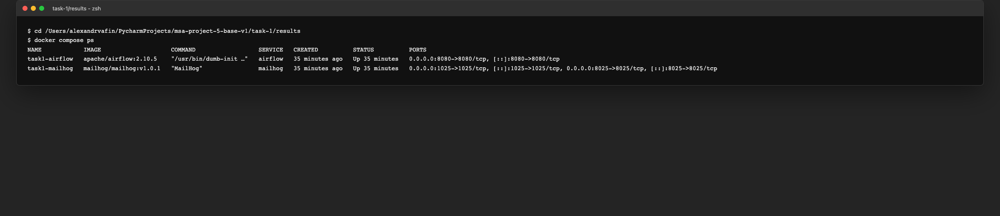
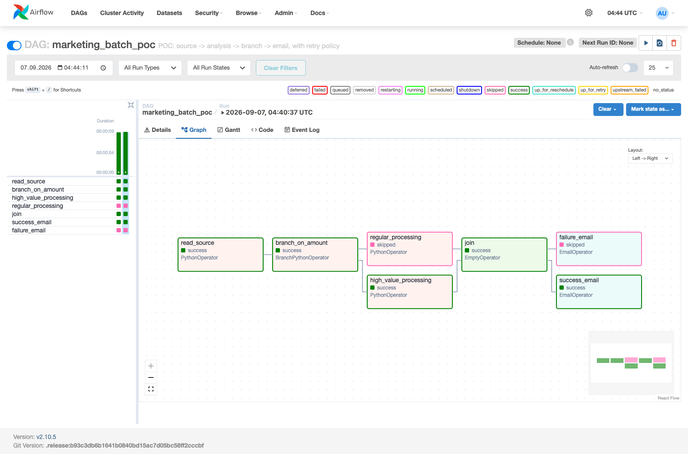
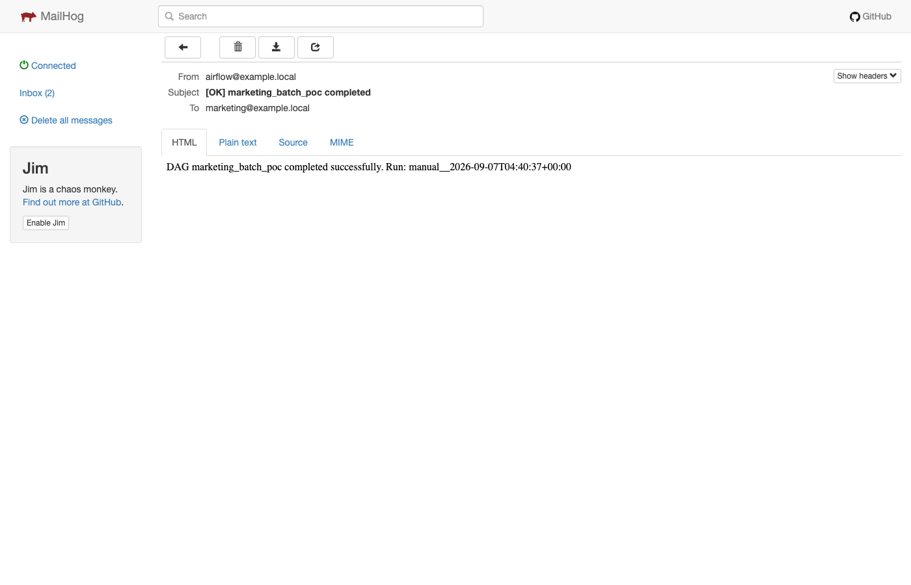
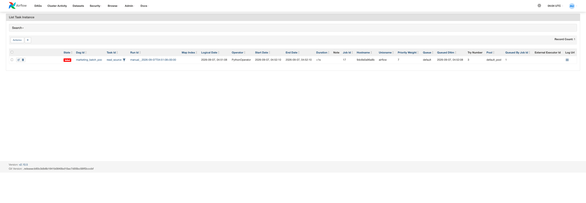
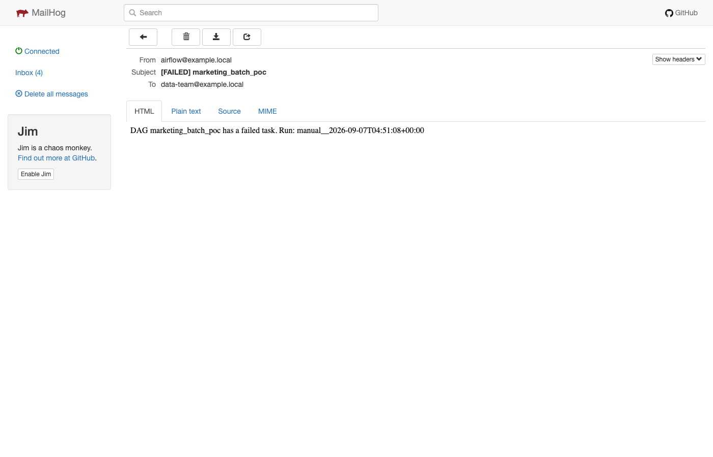

# Task 1. Выбор и реализация решения для пакетной обработки данных

Для решения выбран **Apache Airflow**.

Архитектурное обоснование выбора оформлено отдельно в формате ADR:

- `ADR-001-batch-processing-platform.md` — контекст, decision drivers, рассмотренные альтернативы, интеграции с BigQuery/Redshift/Kafka/Spark, branching, event-triggered запуск, fallback/retry/email, cloud deployment и последствия решения.

## Состав POC

В этой директории находятся:

- `ADR-001-batch-processing-platform.md` — архитектурное обоснование выбора Airflow;
- `docker-compose.yml` — локальный Apache Airflow + MailHog;
- `dags/marketing_etl.py` — DAG с чтением источника, анализом, ветвлением, retry и email;
- `data/orders.csv` — тестовый источник данных;
- `DEMO.md` — пошаговый сценарий локальной демонстрации и перечень необходимых скриншотов.

## Что демонстрирует POC

```text
read_source
     |
branch_on_amount
   /        \
high_value  regular
   \        /
      join
      / \
 success  failure
  email    email
```

DAG `marketing_batch_poc` закрывает требования задания:

1. **Чтение из источника данных** — `read_source` читает CSV.
2. **Анализ данных** — рассчитывается агрегированный `total_amount`.
3. **Ветвление** — `BranchPythonOperator` выбирает `high_value_processing` либо `regular_processing`.
4. **Условное объединение веток** — `join` использует `none_failed_min_one_success`; невыбранная ветка может быть `skipped`.
5. **Уведомление об успехе** — `success_email` отправляет email через локальный MailHog.
6. **Retry policy** — для tasks настроены `retries`, `retry_delay`, exponential backoff и `max_retry_delay`.
7. **Failure path** — после исчерпания retries аварийная ветка приводит к `failure_email`.
8. **Уведомление об ошибке** — `failure_email` отправляет письмо в MailHog.

## Важное ограничение POC

`read_source` передаёт через XCom только небольшой агрегированный summary.

В production Airflow не должен передавать через XCom весь набор примерно из 1 млн записей. Большие промежуточные данные следует сохранять во внешнем хранилище/аналитической системе, а между tasks передавать URI, ID или небольшие metadata.

## Локальный запуск

```bash
docker compose up -d
```

После запуска:

- Airflow UI: `http://localhost:8080`;
- MailHog: `http://localhost:8025`.

Дальнейшие шаги успешного и аварийного сценария описаны в `DEMO.md`.

## Демонстрация

Локальное развёртывание Airflow и MailHog через Docker Compose:



Успешный запуск DAG с ветвлением:



Success notification в MailHog:



Failure-сценарий с retry policy: `read_source` завершился с `Try Number = 3`.



Failure notification в MailHog:


