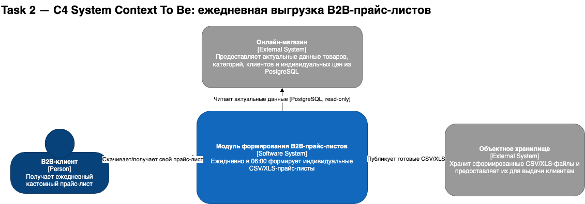

# Task 2. Дизайн модуля пакетной обработки прайс-листов

## Результаты задания

Для ежедневного формирования B2B-прайс-листов выбрана связка **Kubernetes CronJob → Job → Pod**.

Архитектурное решение и сравнительная таблица оформлены отдельно:

- `ADR-002-b2b-price-list-batch-processing.md` — контекст, decision drivers, сравнение Spring Batch / Apache Airflow / K8s Job+CronJob / Spark, принятое решение и последствия;
- `c4-context-to-be.drawio` — редактируемая **C4 System Context To Be** диаграмма;
- `c4-context-to-be.png` — экспорт диаграммы для просмотра прямо в GitHub README;
- `c4-context-to-be.puml` — исходник C4 System Context в PlantUML;
- `c4-to-be.puml` — дополнительная C4 Container To Be диаграмма с детализацией exporter/БД/object storage;
- `IMPLEMENTATION_PLAN.md` — верхнеуровневый пошаговый план конфигурации и имплементации.

## Исходные условия

Каждое утро ровно в **06:00** требуется связать данные PostgreSQL:

- `products` — ~5 000–10 000 строк;
- `categories` — ~50–200 строк;
- `clients` — ~100–500 строк;
- `client_prices` — ~10 000–20 000 строк.

Результат — кастомные CSV/XLS-прайс-листы для B2B-клиентов. Объём одной выгрузки — порядка **5 000–10 000 строк**. Дополнительной сложной обработки, ветвлений, ML или распределённых вычислений не требуется. Инфраструктура уже облачная и микросервисная.

## Выбранное решение

**Kubernetes CronJob** лучше всего соответствует текущему кейсу:

1. задача строго периодическая — один запуск в сутки в 06:00;
2. pipeline фактически состоит из одной простой операции экспорта;
3. объём данных не оправдывает Spark;
4. Airflow и Spring Batch добавляют платформенную сложность, которая не нужна для одного простого Job;
5. CronJob нативно интегрируется с существующей Kubernetes-инфраструктурой и не требует постоянно работающего scheduler-сервиса приложения;
6. `concurrencyPolicy`, `startingDeadlineSeconds`, `backoffLimit`, history limits и exit status дают предсказуемое поведение при сбоях.

Полное обоснование и сравнительная таблица находятся в `ADR-002-b2b-price-list-batch-processing.md`.

## C4 System Context To Be

На контекстной диаграмме выделен отдельный программный модуль **«Модуль формирования B2B-прайс-листов»**.

Он взаимодействует с:

- **онлайн-магазином** — получает актуальные данные товаров, категорий, клиентов и индивидуальных цен из PostgreSQL;
- **объектным хранилищем** — публикует готовые CSV/XLS;
- **B2B-клиентом** — предоставляет доступ к сформированному прайс-листу.

Kubernetes на C4 System Context сознательно не изображается как отдельная бизнес-система: это инфраструктурная деталь развёртывания. Она показана на дополнительной Container To Be диаграмме через технологию контейнера `Kubernetes CronJob → Job → Pod`.

Исходники:

- `c4-context-to-be.drawio`;
- `c4-context-to-be.puml`;
- дополнительная детализация — `c4-to-be.puml`.

## Как работает решение

1. Kubernetes CronJob с расписанием `0 6 * * *` в заданном `timeZone` создаёт `Job`.
2. `Job` запускает одноразовый `Pod` с контейнером `price-list-exporter`.
3. Экспортёр открывает read-only соединение с PostgreSQL.
4. SQL с JOIN связывает `products`, `categories`, `clients`, `client_prices` и возвращает данные, отсортированные по `client_id`.
5. Результат читается потоково. При смене `client_id` экспортёр завершает файл текущего клиента и начинает следующий, что позволяет избежать N+1-запросов и не держать весь набор в памяти.
6. CSV записывается потоково; для XLSX используется streaming/write-only API.
7. Каждый файл сначала создаётся как временный объект и только после полного успешного формирования публикуется под финальным детерминированным ключом, например `price-lists/<run-date>/<client-id>/price-list.csv`.
8. В production результат сохраняется в объектное хранилище (GCS/S3-compatible), а не на локальном filesystem Pod.
9. При успехе процесс завершается кодом `0`; Kubernetes помечает Job как `Succeeded`.
10. При ошибке Kubernetes выполняет ограниченные повторные попытки в пределах `backoffLimit`; `concurrencyPolicy: Forbid` не позволяет новому ежедневному запуску пересечься с предыдущим.
11. Логи контейнера собираются централизованно; состояние и длительность Job контролируются через Kubernetes/Prometheus/Grafana.

## План реализации

Подробный верхнеуровневый план находится в `IMPLEMENTATION_PLAN.md` и включает:

- разработку stateless exporter;
- SQL/JOIN и потоковое формирование отдельных файлов по клиентам;
- идемпотентную публикацию результатов;
- контейнеризацию;
- конфигурацию CronJob;
- Secrets/RBAC/resources;
- object storage;
- мониторинг и логирование;
- функциональные, отказоустойчивые и нагрузочные проверки перед production.
