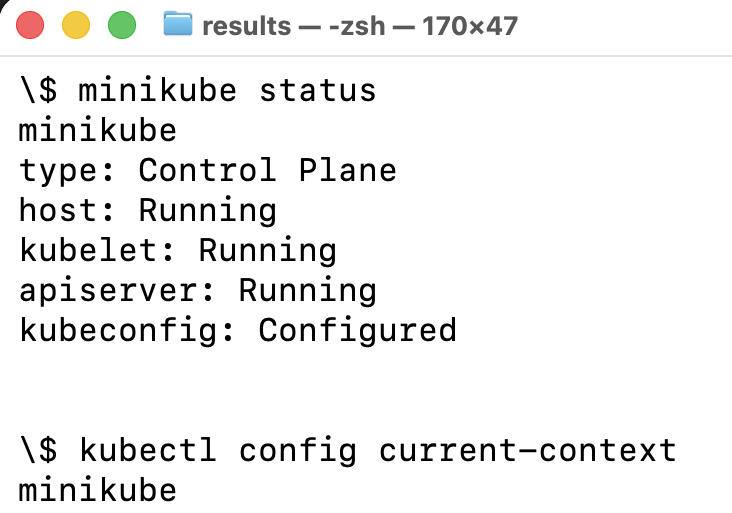
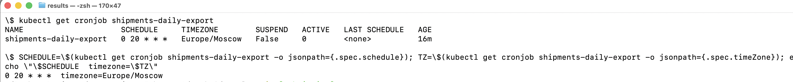
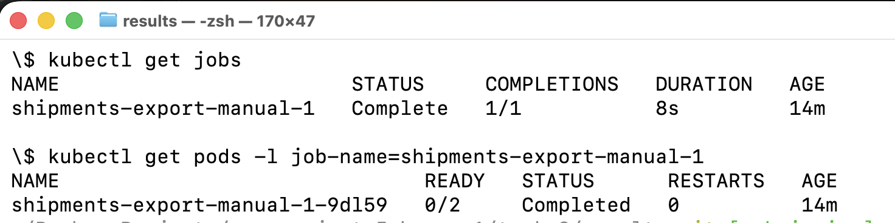
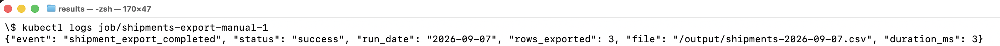
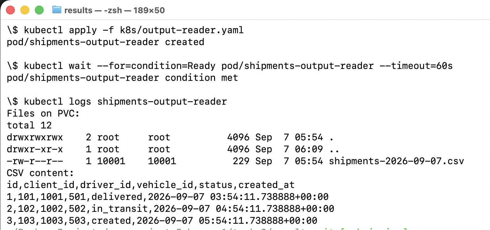

# Task 3. Distributed Scheduling с Kubernetes CronJob

Задача: каждый день ровно в **20:00** выгружать данные для аналитиков. В POC экспортируется одна таблица `shipments` из PostgreSQL в CSV.

## Состав решения

- `app/export.py` — потоковая выгрузка `shipments` в CSV;
- `app/Dockerfile` — Docker-образ экспортёра;
- `app/requirements.txt` — Python-зависимости;
- `k8s/postgres-demo.yaml` — PostgreSQL для демонстрации в MiniKube;
- `k8s/init.sql` — отдельный SQL-пример тестовых данных;
- `k8s/output-pvc.yaml` — PVC для CSV в POC;
- `k8s/cronjob.yaml` — целевая конфигурация запуска ежедневно в 20:00;
- `k8s/output-reader.yaml` — временный Pod для проверки CSV на PVC;
- `DEMO.md` — сценарий проверки и перечень скриншотов;
- `screenshots/` — скриншоты локального запуска в MiniKube, CronJob, Completed Job, JSON-лога и CSV на PVC.

## Ключевые решения

- `schedule: "0 20 * * *"` и явный `timeZone: "Europe/Moscow"`;
- если бизнес использует другой часовой пояс, `timeZone` нужно заменить на него, не пересчитывая cron вручную;
- `concurrencyPolicy: Forbid` — новый **плановый** запуск этого CronJob не пересекается с предыдущим;
- `startingDeadlineSeconds` — ограничивает допустимый запоздалый запуск;
- `backoffLimit` — ограниченные повторы при ошибке;
- `restartPolicy: Never` — повторением управляет Job controller;
- requests/limits — предсказуемое потребление CPU/RAM;
- экспорт выполняется через server-side cursor партиями по 5000 строк, а не загружает всю таблицу в память;
- файл сначала пишется во временное имя, затем атомарно переименовывается;
- имя файла содержит бизнес-дату и обеспечивает понятный повторный запуск;
- секреты БД передаются через Kubernetes Secret. Значения в demo-манифесте предназначены только для локального MiniKube;
- приложение запускается от непривилегированного пользователя и с `readOnlyRootFilesystem`.

Для production PVC следует заменить на специализированное объектное/аналитическое хранилище, если именно оно принято в инфраструктуре. Контейнер остаётся stateless.

## Демонстрация

MiniKube запущен, текущий Kubernetes context — `minikube`:

CronJob создан с расписанием `0 20 * * *` и `timeZone: Europe/Moscow`:

Ручной Job, созданный из шаблона CronJob, завершился успешно:

Лог Job подтверждает успешный экспорт `shipments` и `rows_exported: 3`:

Reader Pod показывает CSV-файл на PVC с заголовком и тремя строками:

