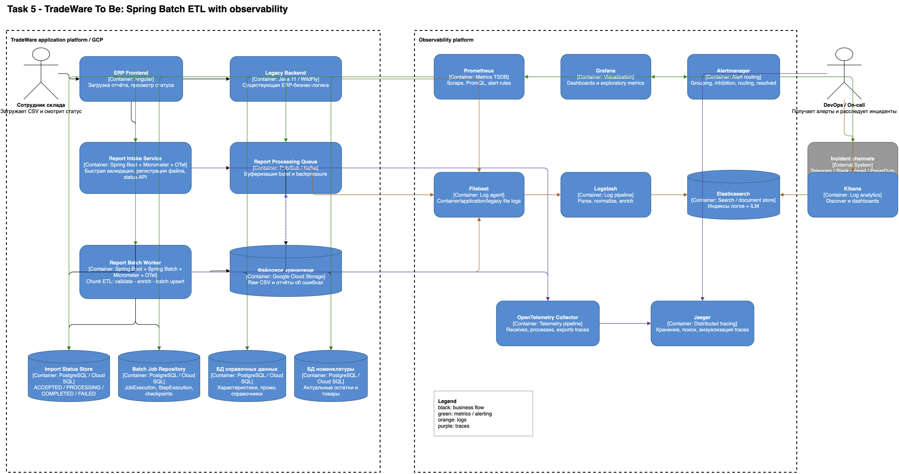

# Task 5. Мониторинг, логирование и оповещение TradeWare

## 1. Цель

После внедрения асинхронного Spring Batch ETL из Task 4 наблюдаемость должна отвечать минимум на четыре вопроса:

1. **Принимает ли система загрузки?**
2. **Успевает ли batch обрабатывать очередь с требуемой скоростью?**
3. **Где находится bottleneck: API, worker, БД, очередь или инфраструктура?**
4. **Почему конкретный файл/job завершился ошибкой?**

Для этого используется связка трёх сигналов observability:

- **metrics:** Prometheus + Grafana;
- **logs:** Filebeat → Logstash → Elasticsearch → Kibana;
- **traces:** OpenTelemetry → Jaeger.

Оповещения: Prometheus alert rules → Alertmanager → рабочий канал команды (Telegram/Slack/email/PagerDuty — в зависимости от severity).

Архитектурная диаграмма Task 5 является расширением To Be C4 из Task 4: сохраняются Legacy Backend, Report Intake Service, Report Processing Queue, Report Batch Worker, GCS, Import Status Store, Batch Job Repository, БД справочных данных и БД номенклатуры. Observability Platform добавлена поверх этой архитектуры отдельным блоком.

## Архитектура To Be



## 2. Почему одних RED-метрик недостаточно

RED (`Rate`, `Errors`, `Duration`) отлично подходит для request-driven API, но в материалах курса отдельно отмечено, что RED не является достаточной моделью для batch processing.

Поэтому мониторинг делится на три слоя:

1. **Online API:** RED / Four Golden Signals.
2. **Batch pipeline:** job, queue, rows, retry, SLA/checkpoint metrics.
3. **Resources:** USE (`Utilization`, `Saturation`, `Errors`) для JVM, pod, PostgreSQL и очереди.

## 3. Метрики

### 3.1. API / Report Intake Service

| Метрика | Тип | Назначение |
|---|---|---|
| `http_server_requests_seconds_count{method,uri,status}` | Counter | Rate и Errors по API |
| `http_server_requests_seconds_sum{method,uri,status}` | Counter | суммарная длительность для average latency |
| `http_server_requests_seconds_bucket{method,uri,status,le}` | Histogram bucket | latency/p95/p99 |
| `tradeware_uploads_total{result}` | Counter | принятые/отклонённые загрузки |
| `tradeware_upload_file_size_bytes` | Histogram | изменение размера входных файлов |
| `jvm_memory_used_bytes` | Gauge | heap pressure |
| `process_cpu_usage` | Gauge | CPU utilization |

**Важно:** не помещать в labels `user_id`, `file_id`, URL с динамическим id и другие high-cardinality значения. Такие идентификаторы идут в логи/traces.

Для p95/p99 через `http_server_requests_seconds_bucket` нужно включить публикацию histogram в Micrometer:

```yaml
management:
  metrics:
    distribution:
      percentiles-histogram:
        http.server.requests: true
```

### 3.2. Batch Worker / Spring Batch

| Метрика | Тип | Почему нужна |
|---|---|---|
| `tradeware_batch_jobs_started_total` | Counter | интенсивность batch-нагрузки |
| `tradeware_batch_jobs_completed_total` | Counter | успешность обработки |
| `tradeware_batch_jobs_failed_total{error_code}` | Counter | частота и типы отказов |
| `tradeware_batch_job_duration_seconds{size_class}` | Histogram | контроль требования 2 000 строк ≤ 30 сек и p95 |
| `tradeware_batch_rows_read_total` | Counter | объём чтения |
| `tradeware_batch_rows_written_total` | Counter | фактический throughput |
| `tradeware_batch_rows_skipped_total{reason}` | Counter | качество данных / skip policy |
| `tradeware_batch_retries_total{reason}` | Counter | нестабильность внешних зависимостей |
| `tradeware_batch_chunk_duration_seconds` | Histogram | подбор chunk size и поиск медленных commit |
| `tradeware_batch_active_jobs` | Gauge | текущая concurrency |

Для Spring Boot метрики экспортируются через **Micrometer/Actuator** на `/actuator/prometheus`, затем Prometheus забирает их по pull-модели.

Для SLA используется низкокардинальная метка `size_class`: `le_2000`, `2001_10000`, `gt_10000`. Правило «2 000 строк ≤ 30 секунд» проверяется по `tradeware_batch_job_duration_seconds{size_class="le_2000"}`, чтобы большие отчёты не искажали среднее по целевому классу.

### 3.3. Queue / backpressure

| Метрика | Тип | Почему нужна |
|---|---|---|
| `tradeware_queue_depth` | Gauge | backlog, главный индикатор насыщения batch |
| `tradeware_queue_oldest_message_age_seconds` | Gauge | показывает, сколько реально ждёт самый старый файл |
| `tradeware_queue_consumption_rate` | Gauge/derived | успевают ли workers разгребать поток |
| `tradeware_queue_publish_errors_total` | Counter | ошибки Intake → Queue |

Для burst 100–150 загрузок именно queue depth и oldest age важнее простого CPU: CPU может быть нормальным, пока очередь уже нарушает SLA.

### 3.4. PostgreSQL

- active connections / max connections;
- connection pool utilization;
- transaction rate;
- query duration;
- lock wait / deadlocks;
- disk I/O saturation;
- errors/timeouts.

Критично видеть DB saturation, потому что горизонтальное увеличение batch workers без лимита способно ухудшить производительность.

### 3.5. Kubernetes / JVM

USE-набор:

- CPU utilization;
- memory working set / heap;
- memory limit и OOMKilled;
- pod restarts;
- throttling CPU;
- pending pods;
- filesystem/volume errors;
- worker saturation (active jobs / configured concurrency).

## 4. Grafana dashboard

Один верхнеуровневый dashboard `TradeWare Batch Overview`:

1. Upload rate и HTTP error rate.
2. API p95 latency.
3. Queue depth + oldest message age.
4. Active batch jobs.
5. Jobs completed/failed per minute.
6. Average/p95 batch duration.
7. Rows written/sec.
8. Retry/skip rate.
9. DB connections/locks/query latency.
10. CPU/RAM/pod restarts.

Переменные Grafana: `environment`, `service`, `namespace`, `pod`. Не использовать `file_id` как dashboard variable из Prometheus из-за cardinality — конкретный файл ищется в Kibana/Jaeger.

Аннотации Grafana: deploy/release markers, чтобы сопоставлять деградацию с релизами.

## 5. Alerting

Alertmanager группирует алерты по `alertname`, `service`, `environment`, использует `for`, чтобы отсечь короткие всплески, и отправляет `resolved` уведомления.

Предварительные правила должны быть подтверждены нагрузочным тестом.

### Critical

- batch job завершился `FAILED` после исчерпания retry;
- очередь перестала обрабатываться и oldest message age превышает допустимое окно;
- Intake API недоступен;
- PostgreSQL недоступен;
- OOMKilled batch worker.

### Warning

- среднее время batch report около/выше 30 секунд на устойчивом окне;
- p95 API latency выше согласованного SLO;
- DB connection pool > 80%;
- queue depth устойчиво растёт;
- retry/skip rate вырос относительно baseline.

Пример правил находится в `prometheus-alerts.yml`.

Каждый production alert должен содержать:

- `severity`;
- `service`;
- `team`;
- `environment` — добавляется через `external_labels` конкретного Prometheus instance, чтобы один и тот же файл правил работал в dev/test/prod;
- `summary`;
- `description`;
- ссылку на `runbook`;
- ссылку на dashboard/query при возможности.

## 6. Логирование: выбран ELK

### Поток

```text
Application stdout JSON
        |
Filebeat (DaemonSet / agent)
        |
Logstash (parse/enrich/filter)
        |
Elasticsearch
        |
Kibana Discover / Dashboard
```

Почему ELK:

- централизует логи monolith + новых сервисов + batch workers;
- Elasticsearch оптимизирован под поиск документов и полей;
- Kibana позволяет быстро фильтровать события одного `file_id`/`job_execution_id`;
- Logstash позволяет нормализовать старые WildFly-логи и новые JSON logs в общую схему;
- Filebeat подходит как лёгкий агент доставки контейнерных/файловых логов.

Если из-за лицензирования/корпоративного стандарта Elastic неприемлем, архитектурно близкой альтернативой является OpenSearch + OpenSearch Dashboards.

### Формат application log

Новые сервисы должны писать структурированный JSON в stdout/stderr:

```json
{
  "@timestamp": "2026-09-06T16:20:15.123Z",
  "level": "INFO",
  "service": "report-batch-worker",
  "environment": "prod",
  "trace_id": "...",
  "span_id": "...",
  "file_id": "f-12345",
  "job_execution_id": 9123,
  "step": "enrich-and-write",
  "event": "chunk_completed",
  "rows_read": 500,
  "rows_written": 500,
  "duration_ms": 820
}
```

Для ошибки дополнительно:

- `error_code` — стабильный машинный код;
- `exception_class`;
- `message`;
- stacktrace (ERROR);
- retry attempt.

### Что нельзя логировать

- пароли, access/refresh tokens;
- строки подключения с credentials;
- полные банковские/платёжные реквизиты;
- лишние персональные данные;
- полное содержимое загружаемого файла.

Вместо содержимого — `file_id`, checksum, row number и технический error code.

### Уровни

- `INFO` — job/step start/complete, итоговые counts;
- `WARN` — recoverable anomaly, retry, допустимый skip;
- `ERROR` — job/step failure и неисправимые ошибки;
- `DEBUG/TRACE` — временно для диагностики, постоянно на production не включать.

## 7. Elasticsearch indices и retention

Использовать статический mapping, а не бесконтрольный dynamic mapping.

Пример паттернов:

- `tradeware-app-logs-*`;
- `tradeware-audit-*`.

Ключевые keyword fields: `service`, `environment`, `level`, `event`, `error_code`, `file_id`, `trace_id`.

`message`/stacktrace — text; `duration_ms`, counts — numeric; `@timestamp` — date.

Использовать **ILM**:

1. hot — свежие логи для расследований;
2. rollover по age/size/shard size;
3. warm/cold при необходимости;
4. delete после согласованного retention.

Обычные технические логи можно хранить, например, 30 дней, audit/security — согласно требованиям ИБ/законодательства. Конкретные сроки должны быть утверждены владельцем данных и ИБ.

## 8. Distributed tracing

OpenTelemetry SDK добавляется в Intake Service и Batch Worker.

- один `trace_id` связывает входную загрузку, сохранение в GCS, публикацию команды и batch execution;
- `span_id` — отдельные операции;
- context propagation передаётся через HTTP и message headers;
- Jaeger визуализирует цепочку и длительность spans.

Это позволяет из Kibana по `trace_id` перейти к конкретному trace и увидеть, например, что задержка была не в обработке CSV, а в DB writer.

## 9. Корреляция трёх сигналов

Типовой incident flow:

1. Alertmanager: `TradeWareQueueAgeHigh`.
2. Grafana: видим рост queue age и DB pool saturation.
3. Kibana: фильтр `service=report-batch-worker AND level=ERROR/WARN`.
4. По `trace_id` открываем Jaeger.
5. Видим медленный span JDBC/lock wait.
6. После исправления проверяем метрики и `resolved` alert.

Так metrics обнаруживают проблему, logs объясняют детали, traces показывают путь запроса/операции.

## 10. Связь с учебными практиками

В качестве практических ориентиров для локального POC применимы репозитории из уроков:

- `db-exp/monitoring-alerting` — Prometheus + Alertmanager + уведомления;
- `db-exp/elka` — ELK/Filebeat/Logstash pipeline.

В production секреты из примеров нельзя хранить в репозитории: токены/credentials должны поступать из Secret Manager/Kubernetes Secret.

Исходники архитектурной диаграммы: `c4-observability.puml` и `c4-observability.drawio`; экспорт для просмотра: `c4-observability.png`.
